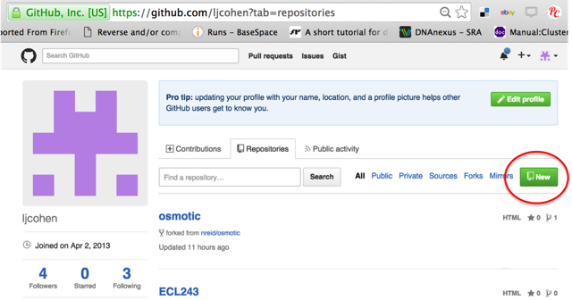
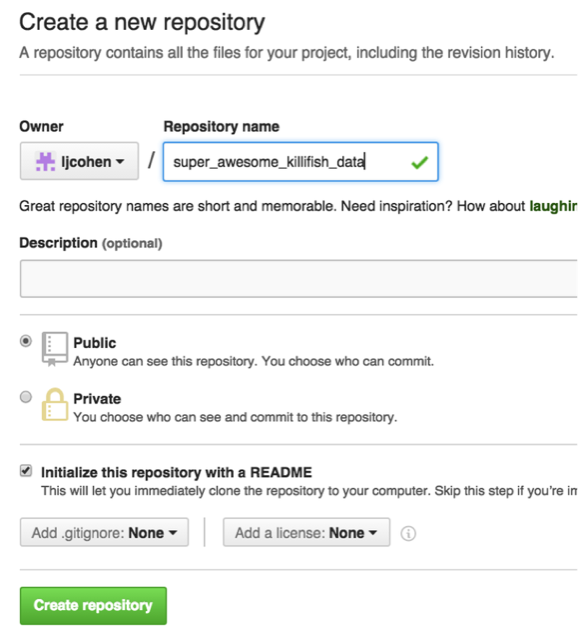
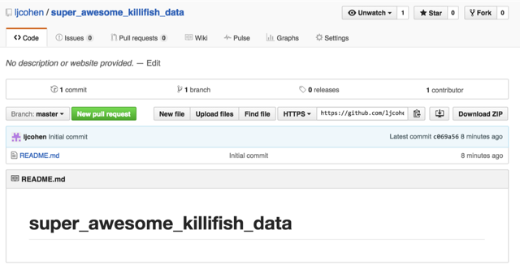
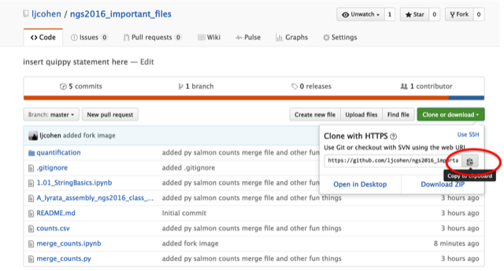
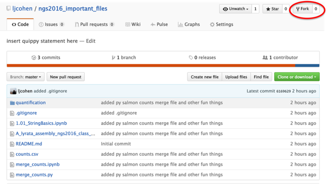
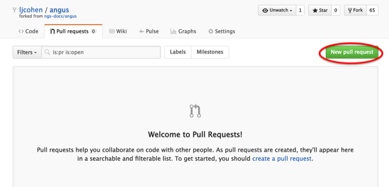
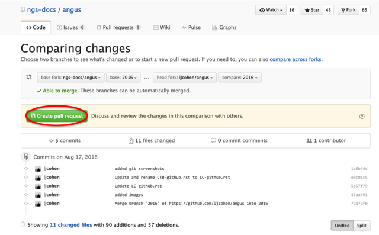
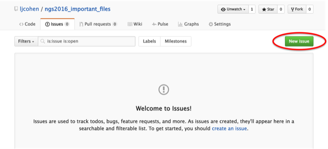

# Using GitHub repositories to store your scripts

By the end of this lesson, you will be able to:

1. Make a new github repo
2. Edit README.md
3. Fork and clone a repo
4. Make changes, commit and push changes
5. Submit a pull request
6. Submit an issue

# Create a new repository

Github has special terms for their parts and workflows (forking, pushing, pulling and cloning). These are all basically related to storing files and moving them around. A repo (or repository) is like a folder.

Go to [github.com](https://github.com/), sign in (or sign up if you haven't already). 
Then go to your profile page (e.g.  Lisa's is [https://github.com/ljcohen](https://github.com/ljcohen), then select "New repository".

   [](_static/git_new_repository.png)

Name can be something like 'super_awesome_killifish_data', whatever is fine!  Be sure to check the
'initialize with Readme' box.

   [](_static/git_create_repo.png)

Your repo should look something like this:
   
   [](_static/git_repo_created.png)


# Edit README.md

Click on the pen icon to edit README.md to edit the file. Here is a [markdown cheat sheet](https://github.com/adam-p/markdown-here/wiki/Markdown-Cheatsheet) 

Add some formatting things, like [hyperlinks](http://whatshouldwecallgradschool.tumblr.com) and lists:

* apple
* bananas
* llamas

or images:

   

# Clone your repository

Get your GitHub repository url, e.g. `https://github.com/ljcohen/super_awesome_killifish_data.git`

 [](_static/git_clone_important.png)

Then, on your local laptop or remote UNIX machine, navigate to a directory where you would like to copy the files. Then type:
   
   ```
   git clone https://github.com/ljcohen/super_awesome_killifish_data.git
   ```

This will create a new directory named `super_awesome_killifish_data` and download the contents to your coputer or machine. In this case, there is only a single file `README.md`. If you're on your local computer, open up your Finder and navigate to the directory to see the files. Now you can add files and they will be version controlled!

# Fork an existing repository

Now we will do something else. Let's say we made some important files during an NGS course. Let's all collaborate and decide what those files are. I created a repository of files. Perhaps you would like to modify this collection. [Click on this link](https://github.com/ljcohen/ngs2016_important_files) to go to this github repo and fork it.

   [](_static/git_fork.png)
   
This will fork the repository into your account. Make sure that you can see it listed as a repository on your profile. You have just created a copy of all the files from my repo and brought them into your profile! 

Now, clone this new repository by copying the url like you did before and typing.
   
   ```
   git clone https://github.com/youraccountname/ngs2016_important_files.git
   
   ```


# Make changes, commit and push changes

When you clone a repository, you are creating a directory (folder) onto your home computer by this name. Locate this `ngs2016_important_files` directory on your local computer. Make some changes (any changes!), such as copying a random file(s) or editing any existing files. What are some important files you have from this course that you would like everyone else to have? Perhaps you would like to propose changes to the `README.md` file?

Once you have made these changes, commit and push these changes to your github profile.

First, on your local terminal, type:
   
   ```
   git add --all
   git checkout
   ```

This will check and display a list of the changes you've made. Then type:
   
   ```
   git commit -m "this is a special message from Lisa"
   ```

This will commit the changes made and get them ready for uploading. 


Now upload with this command:
 
   ```
   git push origin master
   ```

Open your profile on the web and you should see the files!

Your repo may get behind other changes I'm making or others are making. We will now make sure your repo is up-to-date. To see the address of the remote repo:
   
   ```
   git remote -v
   ```

You should see your own url. To add my url, go to my repo and copy the clone url:
   
   ```
   git remote add upstream https://github.com/ljcohen/ngs2016_important_files.git
   git remote -v
   ```

Now you should see my repo url as upstream and your url as origin. To make your repo up-to-date, type:

   ```
   git pull upstream master
   ```

Files should download if there were any changes made to the web version of the repo.

# Submit a pull request

It's great that you have these changed files in your repo! Now you want to share with your collaborators so everyone has the same version of the files collection in their repo. Go to your repo and click on submit a pull request:

   [](_static/git_pull_request.png)

You will see two comparisons between the master and your repo. There shouldn't be an conflicts, so click on 'Create pull request':

   [](_static/git_create_pull_request.png)
   
This will make a request for your changes to be pulled into and merged with the original repo.

# Submit an issue

Sometimes we have issues with software, find bugs or have questions, and want to be able to communitcate with the authors. Github has this great feature where you can file issues, and makes them public records: [https://github.com/nvbn/thefuck/issues/440](https://github.com/nvbn/thefuck/issues/440)

Practice by creating an issue with this repo:

[](_static/git_issue.png)
   
# Storage of Jupyter notebooks to explore data

Github repos contain static documents. Github suports rendering of `.ipynb`, `.pdf`, `.Rmd`, `.md`, `.rst` files. (and probably many more...) This is a great way to post files and share with your boss, colleagues, or just store documents for yourself. This way, all you have to do is share the url link.


# Useful commands
* `git add script.txt` will add the file script.txt into your local git
  repository.

* `git commit -am "some message"` will save the latest version of the script
  into your local git repository

* `git push origin` will send your committed versions to github, where
  they will be safe.

* `git log` will show you your history.

* `git pull` will update your command-line repository from your
  GitHub account.
  
* `git status` will show what files have been changed
  
# References

* [Contributing to open-source software project on github, khmer](http://khmer.readthedocs.io/en/latest/dev/getting-started.html)
* [ANGUS 2016 github lesson](http://angus.readthedocs.io/en/2016/CTB-github.html)
* [Lab meeting on github](https://monsterbashseq.wordpress.com/2016/03/08/intro-git-lab-meeting/)
* [Sign up for private repos for education](https://education.github.com/guide/private_repos)
* [Software Carpentry, github for novices lesson](https://swcarpentry.github.io/git-novice/)
* [Intro git, halfday workshop at UC Davis](http://dib-training.readthedocs.io/en/pub/2016-02-05-intro-git.html)
* [Github for classrooms](https://classroom.github.com/)
* [Issue pushing large files to github, how to solve](http://stackoverflow.com/questions/19573031/cant-push-to-github-because-of-large-file-which-i-already-deleted)
