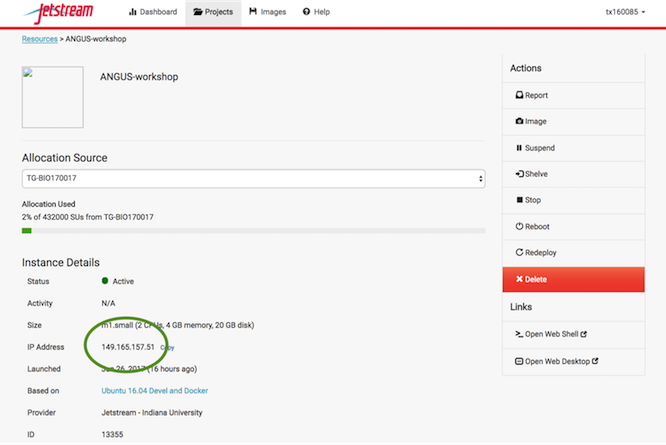
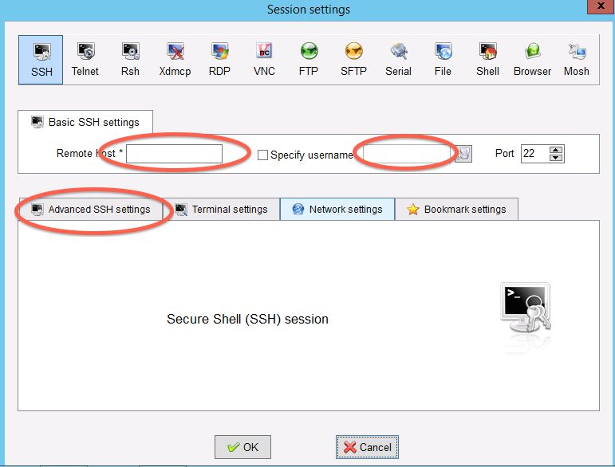
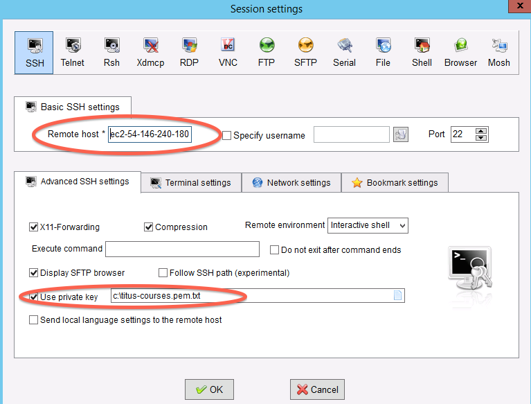
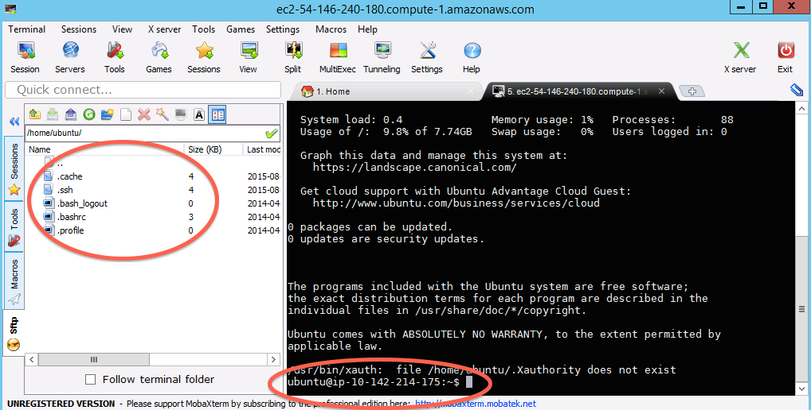

# Logging in to jetstream from your local terminal with a key file

Some of us have had problems with the web shell and getting into the Jetstream
portal. These materials will show you how to log in using an SSH key through your
local terminal.

## Concerning Keys

Cryptographic keys are a convenient and secure way to authenticate without having to use
passwords. They consist of a pair of files called the public and private keys: the public part can
be shared with whoever you'd like to authenticate with (in our case, Jetstream!), and the private
part is kept "secret" on your machine. Things that are encrypted with the public key can be be
decrypted with the private key, but it is computationally intractable (ie, it would take on the
order of thousands of years) to determine a private key from a public key. You can read more about
it [here](https://en.wikipedia.org/wiki/Public-key_cryptography).

## Getting your instance IP address

In order to connect to your instance, we need to know its IP address, its unique identifier on the
internet. This is listed in your instance details, circled below:

[](../_images/ip-address.png)

Now, things diverge a little.

## Setting up keys

1.  Open a terminal window (either `terminal` on OS X, or git bash on Windows).
2.  Navigate to your home directory: 
```
cd ~
```
3.  Find out if you already have a `.ssh` directory with a public private key pair:
```
ls .ssh  
```
And look for 2 files: `id_rsa` and `id_rsa.pub`

##### If you DO NOT have this directory, or those two files are not present,

4.  run a program to create a key-pair: 
```
ssh-keygen
```
5.  Accept the default location, and don't set a password.

##### Finally (whether you made a brand new key, or not)

6.   Copy the contents of `id_rsa.pub` to your clipboard. (this is your "public key")
7.   Go to your Jetstream account and click your username in the upper right corner.
8.   Click 'Settings'
9.   Click 'show more' under 'Advanced'
10.  Under 'SSH Configuration' click the plus symbol
11.  Paste your public key into the second box
12.  In the top box, give your key a name so you know which private key it's associated with.

Now, when you start a _new_ instance, your public key will be added automatically and you can login without a password.

13.  SSH into your instance 
```
ssh [username]@[instance-ip-address]
```
14.  You should connect automatically(-ish) (without setting or typing your password)

If you have an **already running instance** that you want to access in this way,

15.  Open a new terminal (git bash on Windows) window.
16.  Copy your public key to your instance: 
```
scp ~/.ssh/new_key.pub [username]@[ip-address]:~/.ssh/new_key.pub
```
17.  Using the web interface or logging in using your username and password, navigate to the correct directory: 
```
cd ~/.ssh
```
18.  Use `ls -a` to display files. You should see `new_key.pub`

19.  Copy that key into your authorized keys file:
```
cat new_key.pub >> authorized_keys
```
20.  Retry ssh to see if it worked. 
```
ssh [username]@[instance-ip-address]
```
If it didn't work, go to the instance Jetstream page and "Redeploy" your instance, and then retry the `ssh` command.

Hopefully should now have access to atmosphere within your local terminal!


#### Notes for Windows

For Windows, we need to *install* a terminal. Here we'll use mobaxterm.

### Install mobaxterm

First, download [mobaxterm home edition (portable)](http://mobaxterm.mobatek.net/download-home-edition.html)
and run it.

### Start a new session

[](../_images/moba-1.png)

### Fill in session settings

Fill in your "remote host," which will be the IP address from earlier. Then select
"specify username" and enter `tx160085`.

[](../_images/ec2-moba-2.png)

### Specify the session key

Copy the downloaded private file onto your primary hard disk (generally
C:) and the put in the full path to it.

[](../_images/ec2-moba-3.png)

### Click OK

Victory!

[](../_images/ec2-moba-4.png)
